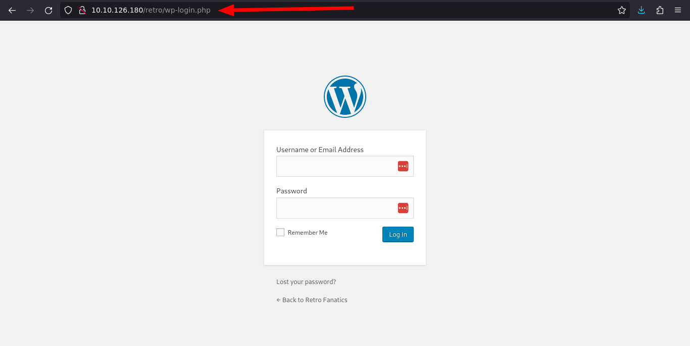
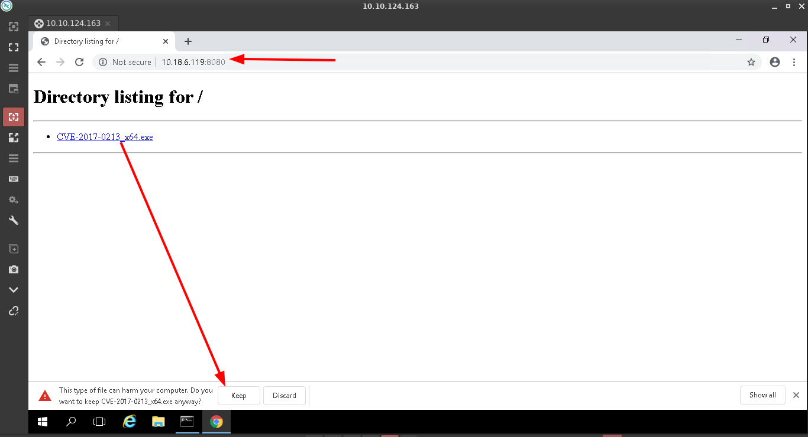

<h1 align="center">:fire: TryHackMe Retro room :fire: </h1>

 

TryHackMe [Room link](https://tryhackme.com/room/retro) 

Copy your tryhackme machine ip and hit on browser. It will show like this. 
 

## Task 1: Pwn
### Q: A web server is running on the target. What is the hidden directory which the website lives on?

You need to run this command on dirsearch tool 

    sudo dirsearch --full-url -w /usr/share/wordlists/Seclist/dirb/directory-list-2.3-medium.txt -u http://10.10.126.180/

After successfully run this command you'll found hidden directory called `retro`. 
 

#### A: `/retro`

### Q: user.txt

As you can see, it's detected WordPress CMS 
 

Also we found WordPress default admin login page. 
 

Now start to scan with wpscan tool for enumerate users of target website. 

    wpscan --url http://10.10.126.180/retro -e u

 

We found a user called `wade` 
 

We found a credintials in the blog post section. `parzival` 
 

Successfully logged in WordPress Dashboard. 
 

Now use any Remote desktop protocol to login, I'm using [Remmina](https://remmina.org). 
 

After login in remote PC I've found a `user.txt` file in desktop. 
 

#### A: `3b99fbdc6d430bfb51c72c651a261927`

### Q: root.txt
Now click on little `search` icon on remote windows PC and type `cmd` hit `Enter`. It will open command prompt. Now type this command and see about system information. 

    systeminfo

 

Now go to this link [Exploit](https://github.com/SecWiki/windows-kernel-exploits/blob/master/CVE-2017-0213/CVE-2017-0213_x64.zip). And download the zip file and extract it. 
 

Open python server on your local machine where you extracted `CVE-2017-0213_x64` file. 

    sudo python3 -m http.server --bind your.tun0.ip 8080

 

It'll generate a link. Now copy the link and hit on remote PC browser. After that download EXE file and make sure Keep it to continue downloading.
 

After downloading completed click to run this program. And type command below to get root flag.

    cd /
    cd Users/Administrator/Desktop
    type root.txt.txt

 

#### A: `7958b569565d7bd88d10c6f22d1c4063`

## Finished!!